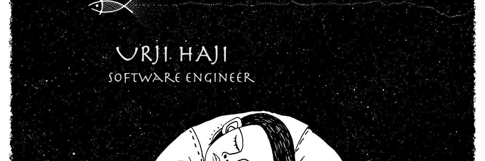

### Hi there I'm Urji👋

A fullstack developer with a love of complex systems and innovation. I code in Python,Javascript and use React, Node.js, PostgreSQL, AWS. 
checkout some of my projects.

🔭 Currently exploring IOT :)

